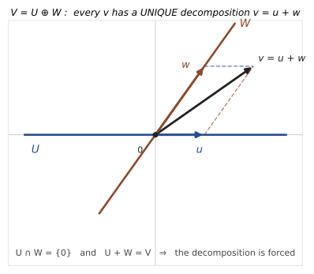

# Direct Sums, Complements, and Decompositions

## 0. The guiding question

A subspace tells us how to focus on a part of a vector space. A quotient tells us how to ignore a part. A direct sum tells us how to split a vector space into independent parts.

The guiding question of this note is:

> When can every vector be decomposed uniquely into pieces coming from chosen subspaces?

The word **uniquely** is the key. A sum of subspaces says that vectors can be built from pieces. A direct sum says that they can be built in only one way.

---

## 1. Sum of subspaces

Let $U,W\subseteq V$ be subspaces. Their sum is

$$
U+W=\{u+w\mid u\in U,\ w\in W\}.
$$

More generally,

$$
U_1+\cdots+U_m
=
\{u_1+\cdots+u_m\mid u_i\in U_i\}.
$$

The sum is always a subspace. It is the smallest subspace containing all the $U_i$.

A sum tells us that we are allowed to combine vectors from the given subspaces. But it does not promise uniqueness.

For example, if $U\cap W\neq\{0\}$, then the same vector may have different decompositions. If $a\in U\cap W$, then

$$
u+w=(u+a)+(w-a).
$$

Both decompositions are valid, and they are different if $a\neq 0$.

This is why direct sums require a no-overlap condition.

---

## 2. Direct sum of two subspaces

Let $U,W\subseteq V$. We write

$$
V=U\oplus W
$$

if every vector $v\in V$ can be written uniquely as

$$
v=u+w,
$$

where $u\in U$ and $w\in W$.

This is called an **internal direct sum** because $U$ and $W$ are already subspaces inside the same ambient space $V$.

### Theorem: criterion for a direct sum of two subspaces

For subspaces $U,W\subseteq V$, the following are equivalent:

1. $V=U\oplus W$;
2. $V=U+W$ and $U\cap W=\{0\}$;
3. every $v\in V$ has a unique decomposition $v=u+w$, with $u\in U$, $w\in W$.

### Proof idea

The condition $V=U+W$ gives existence: every vector can be written as $u+w$.

The condition $U\cap W=\{0\}$ gives uniqueness. Suppose

$$
u+w=u'+w'.
$$

Then

$$
u-u'=w'-w.
$$

The left side lies in $U$, and the right side lies in $W$. Therefore this vector lies in $U\cap W$. If $U\cap W=\{0\}$, then

$$
u-u'=0,
\qquad
w'-w=0,
$$

so $u=u'$ and $w=w'$.

Conversely, if decomposition is unique, then $V=U+W$ is automatic, and any vector $a\in U\cap W$ has two decompositions:

$$
a=a+0=0+a.
$$

Uniqueness forces $a=0$. Thus $U\cap W=\{0\}$.

---

## 3. Independence of several subspaces

For more than two subspaces, pairwise intersections being zero is not enough. We need a stronger condition.

Subspaces $U_1,\dots,U_m\subseteq V$ are called **linearly independent** if

$$
u_1+\cdots+u_m=0,
\qquad
u_i\in U_i,
$$

implies

$$
u_1=\cdots=u_m=0.
$$

If $U_1,
\dots,U_m$ are linearly independent, then their sum is called a direct sum and is written

$$
U_1\oplus\cdots\oplus U_m.
$$

The meaning is:

> A vector in $U_1+\cdots+U_m$ has exactly one decomposition into a sum of vectors from the $U_i$.

### Theorem: equivalent forms of independence

For subspaces $U_1,\dots,U_m\subseteq V$, the following are equivalent:

1. $U_1,
\dots,U_m$ are linearly independent;
2. every vector in $U_1+
\cdots+U_m$ has a unique decomposition

   $$
   v=u_1+\cdots+u_m,
   \qquad u_i\in U_i;
   $$

3. for every $i$,

   $$
   U_i\cap(U_1+\cdots+U_{i-1}+U_{i+1}+\cdots+U_m)=\{0\}.
   $$

### Proof idea

The equivalence between independence and uniqueness is the same idea as for ordinary vectors. If two decompositions exist, subtract them:

$$
(u_1-u'_1)+\cdots+(u_m-u'_m)=0.
$$

Independence forces each $u_i-u'_i=0$, so the decompositions are the same.

The intersection condition says that no nonzero vector from one subspace can be built from the others. This is exactly what prevents hidden relations among the summands.

---

## 4. Dimension and basis tests for direct sums

Assume now that all spaces are finite-dimensional.

Direct sums are characterized by the fact that dimensions add.

### Theorem: dimension and basis criterion

Let $U_1,
\dots,U_m\subseteq V$ be finite-dimensional subspaces. The following are equivalent:

1. the subspaces $U_1,
\dots,U_m$ are linearly independent;
2. if we choose a basis in each $U_i$, then the union of these bases is a basis of $U_1+\cdots+U_m$;
3. dimensions add:

   $$
   \dim(U_1+\cdots+U_m)
   =
   \dim U_1+\cdots+\dim U_m.
   $$

### Proof idea

Choose a basis in each $U_i$. These basis vectors certainly span $U_1+
\cdots+U_m$. The only question is whether they are linearly independent.

A linear relation among all these basis vectors can be grouped by subspace:

$$
x_1+
\cdots+x_m=0,
\qquad x_i\in U_i.
$$

If the subspaces are independent, then each $x_i=0$. Since each $x_i$ is a linear combination of a basis of $U_i$, all coefficients are zero. Thus the union of the bases is linearly independent.

Once the union is a basis, its number of vectors is the sum of the dimensions, giving the dimension formula. Conversely, if the spanning union has exactly as many vectors as the dimension of the sum, it must be a basis, so no nontrivial relation is possible.

---

## 5. Examples of direct sums

### Coordinate axes

In $\mathbb R^2$,

$$
\mathbb R^2
=
\langle(1,0)\rangle
\oplus
\langle(0,1)\rangle.
$$

Every vector decomposes uniquely:

$$
(x,y)=(x,0)+(0,y).
$$

In $\mathbb R^n$, if $e_1,
\dots,e_n$ is the standard basis, then

$$
\mathbb R^n
=
\langle e_1\rangle\oplus\cdots\oplus\langle e_n\rangle.
$$

This is the coordinate decomposition of a vector.

### Plane plus transverse line

In $\mathbb R^3$, let

$$
U=\{(x,y,0)\mid x,y\in\mathbb R\}
$$

be the $xy$-plane, and let

$$
W=\{(0,0,z)\mid z\in\mathbb R\}
$$

be the $z$-axis. Then

$$
\mathbb R^3=U\oplus W.
$$

Indeed,

$$
(x,y,z)=(x,y,0)+(0,0,z),
$$

and this decomposition is unique.

More generally, a plane through the origin in $\mathbb R^3$ plus any line through the origin not lying in the plane gives a direct sum decomposition of $\mathbb R^3$.

### Symmetric plus skew-symmetric matrices

Assume $\operatorname{char}K\neq 2$. Let $\operatorname{Mat}_n(K)$ be the vector space of $n\times n$ matrices over $K$.

Let $\operatorname{Sym}_n(K)$ be the subspace of symmetric matrices and $\operatorname{Skew}_n(K)$ the subspace of skew-symmetric matrices.

Then

$$
\operatorname{Mat}_n(K)
=
\operatorname{Sym}_n(K)
\oplus
\operatorname{Skew}_n(K).
$$

Every matrix $A$ decomposes as

$$
A=\frac{A+A^T}{2}+\frac{A-A^T}{2}.
$$

The first matrix is symmetric, and the second is skew-symmetric.

### Proof idea

Existence comes from the displayed formula. For uniqueness, suppose $A=B+C$, where $B$ is symmetric and $C$ is skew-symmetric. Then

$$
A^T=B^T+C^T=B-C.
$$

Adding and subtracting the equations gives

$$
B=\frac{A+A^T}{2},
\qquad
C=\frac{A-A^T}{2}.
$$

So the decomposition is forced.

---

## 6. Internal versus external direct sums

An internal direct sum starts with subspaces already living inside a common space:

$$
V=U_1\oplus\cdots\oplus U_m.
$$

An external direct sum starts with separate vector spaces $V_1,
\dots,V_m$ and builds a new vector space:

$$
V_1\oplus\cdots\oplus V_m
=
\{(v_1,
\dots,v_m)
\mid v_i\in V_i\}.
$$

Operations are componentwise:

$$
(v_1,
\dots,v_m)+(w_1,
\dots,w_m)
=
(v_1+w_1,
\dots,v_m+w_m),
$$

and

$$
\lambda(v_1,
\dots,v_m)
=
(\lambda v_1,
\dots,
\lambda v_m).
$$

### Theorem: internal and external direct sums are the same idea

If

$$
V=U_1\oplus\cdots\oplus U_m,
$$

then $V$ is naturally isomorphic to the external direct sum

$$
U_1\oplus\cdots\oplus U_m
$$

by

$$
u_1+\cdots+u_m
\mapsto
(u_1,
\dots,u_m).
$$

Conversely, every external direct sum can be viewed as an internal direct sum using the coordinate subspaces.

### Proof idea

The map from the internal sum to the tuple space is well-defined because the decomposition $v=u_1+
\cdots+u_m$ is unique. It is linear because addition and scalar multiplication happen componentwise. It is bijective because every tuple $(u_1,
\dots,u_m)$ comes from the vector $u_1+\cdots+u_m$.

For the converse, inside $V_1\oplus\cdots\oplus V_m$, define

$$
\widetilde V_i
=
\{(0,
\dots,0,v_i,0,
\dots,0)
\mid v_i\in V_i\}.
$$

Then

$$
V_1\oplus\cdots\oplus V_m
=
\widetilde V_1\oplus\cdots\oplus\widetilde V_m.
$$

---

## 7. Projections associated with a direct sum

If

$$
V=U\oplus W,
$$

then every vector has a unique decomposition

$$
v=u+w.
$$

This allows us to define projections

$$
P_U(v)=u,
\qquad
P_W(v)=w.
$$

These maps extract the $U$-part and the $W$-part of a vector.

### Theorem: direct-sum projections are linear

If $V=U\oplus W$, then $P_U$ and $P_W$ are linear maps.

### Proof idea

Write

$$
v=u+w,
\qquad
v'=u'+w'.
$$

Then

$$
v+v'=(u+u')+(w+w')
$$

is the unique direct-sum decomposition of $v+v'$. Therefore

$$
P_U(v+v')=u+u'=P_U(v)+P_U(v').
$$

Scalar multiplication is the same:

$$
\lambda v=(\lambda u)+(\lambda w),
$$

so

$$
P_U(\lambda v)=\lambda P_U(v).
$$

The proof for $P_W$ is identical.

These projections depend on the chosen complement. If the complement changes, the notion of the $U$-part and the $W$-part changes.

---

## 8. Complements

Let $U\subseteq V$ be a subspace. A subspace $W\subseteq V$ is called a **complement** of $U$ if

$$
V=U\oplus W.
$$

This means every vector $v\in V$ can be written uniquely as

$$
v=u+w,
\qquad u\in U,
\quad w\in W.
$$

A complement is a way of choosing directions that complete $U$ to the whole space.

### Theorem: complements exist in finite-dimensional spaces

If $V$ is finite-dimensional and $U\subseteq V$ is a subspace, then there exists a subspace $W\subseteq V$ such that

$$
V=U\oplus W.
$$

### Proof idea

Choose a basis of $U$:

$$
(e_1,
\dots,e_m).
$$

Extend it to a basis of $V$:

$$
(e_1,
\dots,e_m,e_{m+1},
\dots,e_n).
$$

Now define

$$
W=\langle e_{m+1},
\dots,e_n\rangle.
$$

Every vector in $V$ has a unique expression in the full basis. The part using $e_1,
\dots,e_m$ lies in $U$, and the part using $e_{m+1},
\dots,e_n$ lies in $W$. Hence

$$
V=U\oplus W.
$$

---

## 9. Complements are usually not unique

Complements exist, but they are not usually unique.

In $\mathbb R^2$, let

$$
U=\langle(1,0)\rangle,
$$

the $x$-axis.

The $y$-axis

$$
W_1=\langle(0,1)\rangle
$$

is a complement. But the slanted line

$$
W_2=\langle(1,1)\rangle
$$

is also a complement.

Indeed, every vector $(x,y)\in\mathbb R^2$ can be written uniquely as

$$
(x,y)=(x-y,0)+y(1,1).
$$

So

$$
\mathbb R^2=U\oplus W_2.
$$

In fact, every line through the origin except $U$ itself is a complement of $U$.

This is an important conceptual point:

> A complement is a choice, not an object determined uniquely by $U$.

---

## 10. How to recognize a complement

Suppose $V$ is finite-dimensional and $U,W\subseteq V$.

### Theorem: finite-dimensional complement criterion

The subspace $W$ is a complement of $U$ in $V$ if and only if

$$
U\cap W=\{0\}
$$

and

$$
\dim U+
\dim W=\dim V.
$$

### Proof idea

If $W$ is a complement, then $V=U\oplus W$. Direct sums have zero intersection, and dimensions add:

$$
\dim V=\dim U+
\dim W.
$$

Conversely, suppose $U\cap W=\{0\}$ and the dimensions add to $\dim V$. By the Grassmann formula,

$$
\dim(U+W)=\dim U+\dim W-
\dim(U\cap W)=\dim V.
$$

Since $U+W\subseteq V$ and has the same dimension as $V$, we get

$$
U+W=V.
$$

Together with $U\cap W=\{0\}$, this gives

$$
V=U\oplus W.
$$

---

## 11. The bridge to quotient spaces

Direct sums and quotient spaces meet in one central fact.

Suppose

$$
V=U\oplus W.
$$

Then every vector $v\in V$ has a unique decomposition

$$
v=u+w.
$$

If we pass to the quotient $V/U$, the $u$-part disappears:

$$
v+U=(u+w)+U=w+U.
$$

So the quotient remembers exactly the $W$-component.

### Theorem: a complement is isomorphic to the quotient

If

$$
V=U\oplus W,
$$

then

$$
V/U\cong W.
$$

More precisely, the map

$$
\varphi:W\to V/U,
\qquad
\varphi(w)=w+U
$$

is an isomorphism.

### Proof idea

The map is linear because quotient operations are defined by representatives:

$$
\varphi(w_1+w_2)=(w_1+w_2)+U=(w_1+U)+(w_2+U).
$$

It is injective because if

$$
w+U=w'+U,
$$

then $w-w'\in U$. But $w-w'\in W$ too. Since $U\cap W=\{0\}$, we get $w=w'$.

It is surjective because any coset $v+U$ has a representative in $W$. Write $v=u+w$. Then

$$
v+U=w+U.
$$

So every quotient class comes from exactly one vector of $W$.

### Geometric meaning

In $\mathbb R^3$, let $U$ be the $xy$-plane and let $W$ be the $z$-axis. The quotient $\mathbb R^3/U$ consists of horizontal planes. The $z$-axis intersects each horizontal plane in exactly one point. That point is the representative chosen by the complement $W$.

So the theorem says:

> A complement is a system of representatives for the quotient.

---

## 12. Why the quotient is canonical but the complement is not

If $U\subseteq V$, the quotient $V/U$ is determined by $U$ alone. There is no extra choice.

A complement $W$, however, requires a choice. Different complements give different concrete models of the same quotient.

In $\mathbb R^2$, if $U$ is the $x$-axis, then every non-horizontal line through the origin is a complement. Each one is isomorphic to $\mathbb R^2/U$, but none is preferred by the vector space structure alone.

This is the clean conceptual distinction:

$$
\boxed{\text{The quotient }V/U\text{ is canonical.}}
$$

$$
\boxed{\text{A complement }W\text{ is a choice of representatives.}}
$$

---

## 13. Common mistakes

### Mistake 1: thinking that $U+W$ automatically means $U\oplus W$

A sum need not be direct. Directness requires uniqueness, or equivalently zero intersection in the two-subspace case.

### Mistake 2: checking only pairwise intersections for many subspaces

For more than two subspaces, pairwise intersections being zero is not enough. We need the stronger condition that no nonzero vector in one subspace can be expressed using the others.

### Mistake 3: thinking complements are unique

They are usually not unique. A complement is a choice of extra directions.

### Mistake 4: confusing a complement with a quotient

If $V=U\oplus W$, then $W\cong V/U$, but $W$ is not literally the quotient. The quotient consists of cosets. The complement consists of selected representatives.

---

## 14. Summary

A sum $U+W$ contains all vectors of the form $u+w$.

A direct sum $U\oplus W$ is a sum where the decomposition is unique.

For two subspaces,

$$
V=U\oplus W
$$

means exactly

$$
V=U+W
\quad\text{and}\quad
U\cap W=\{0\}.
$$

For several subspaces, directness means that

$$
u_1+\cdots+u_m=0
$$

with $u_i\in U_i$ forces all $u_i=0$.

In finite dimensions, direct sums are characterized by dimension addition:

$$
\dim(U_1\oplus\cdots\oplus U_m)
=
\dim U_1+
\cdots+
\dim U_m.
$$

A complement of $U$ is a subspace $W$ such that

$$
V=U\oplus W.
$$

Complements always exist in finite-dimensional spaces, but they are usually not unique.

Finally, if $W$ is a complement of $U$, then

$$
V/U\cong W.
$$

The quotient $V/U$ is the abstract space obtained by ignoring $U$. The complement $W$ is a concrete choice of one representative from each quotient class.
