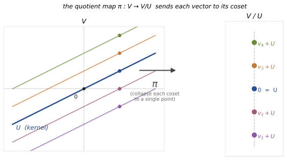
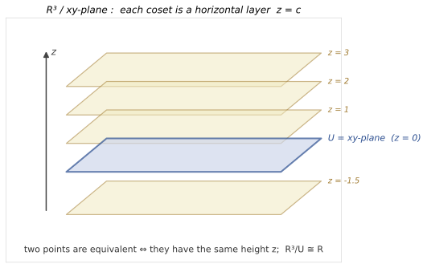
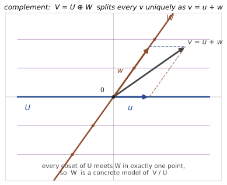

# Quotient Spaces

## 0. The guiding question

A subspace $U\subseteq V$ is a collection of directions inside a vector space. Sometimes we want to ignore those directions.

For example, in $\mathbb R^3$, suppose $U$ is the horizontal $xy$-plane. If we decide that horizontal movement does not matter, then two points should be considered equivalent whenever they have the same height. What remains is a one-dimensional idea: the vertical coordinate.

A quotient space formalizes this idea.

> The quotient $V/U$ is the vector space obtained from $V$ by declaring all vectors of $U$ to be zero.

The point is subtle: the elements of $V/U$ are not the original vectors of $V$. They are equivalence classes of vectors.

---

## 1. Equivalence modulo a subspace

Let $V$ be a vector space over a field $K$, and let $U\subseteq V$ be a subspace.

We define a relation on $V$ by

$$
v\sim v'
$$

if

$$
v-v'\in U.
$$

Equivalently, $v\sim v'$ if there exists some $u\in U$ such that

$$
v=v'+u.
$$

So $v$ and $v'$ are considered the same modulo $U$ if they differ only by a vector from $U$.

This relation is called equivalence modulo $U$, or congruence modulo $U$.

### Theorem: $\sim$ is an equivalence relation

The relation $v\sim v'$ defined by $v-v'\in U$ is reflexive, symmetric, and transitive.

### Proof idea

Reflexivity holds because

$$
v-v=0\in U.
$$

Symmetry holds because if $v-v'\in U$, then

$$
v'-v=-(v-v')\in U.
$$

Transitivity holds because if $v-v'\in U$ and $v'-v''\in U$, then

$$
v-v''=(v-v')+(v'-v'')\in U.
$$

All three steps use exactly the fact that $U$ is a subspace: it contains $0$, is closed under negatives, and is closed under addition.

---

## 2. Cosets: the elements of the quotient

The equivalence class of a vector $v\in V$ is

$$
v+U=\{v+u\mid u\in U\}.
$$

This is called a **coset** of $U$ in $V$.

Important:

> $v+U$ is not one vector. It is a whole subset of $V$.

The quotient space $V/U$ is the set of all such cosets:

$$
V/U=\{v+U\mid v\in V\}.
$$

So an element of $V/U$ is a class of vectors that differ by elements of $U$.

The class of zero is

$$
0+U=U.
$$

Thus the zero vector of the quotient is the whole subspace $U$. This is the precise meaning of saying that $U$ has been collapsed to zero.

---

## 3. Operations in the quotient

We define addition and scalar multiplication of cosets by

$$
(v+U)+(w+U)=(v+w)+U,
$$

and

$$
\lambda(v+U)=(\lambda v)+U.
$$

These definitions are natural: to add two classes, choose representatives, add them in $V$, and take the class of the result.

But there is a possible danger. A coset has many representatives. We must check that the result does not depend on which representatives we choose.

### Theorem: the operations are well-defined

If

$$
v+U=v'+U
$$

and

$$
w+U=w'+U,
$$

then

$$
(v+w)+U=(v'+w')+U.
$$

Also, for every $\lambda\in K$,

$$
(\lambda v)+U=(\lambda v')+U.
$$

### Proof idea

The equality $v+U=v'+U$ means $v-v'\in U$. Similarly, $w-w'\in U$. Therefore

$$
(v+w)-(v'+w')=(v-v')+(w-w')\in U.
$$

So $v+w$ and $v'+w'$ determine the same coset.

For scalar multiplication, if $v-v'\in U$, then

$$
\lambda v-\lambda v'=\lambda(v-v')\in U.
$$

Again, this uses exactly that $U$ is closed under addition and scalar multiplication.

### Theorem: $V/U$ is a vector space

With the operations above, $V/U$ is a vector space over $K$.

### Proof idea

Once the operations are well-defined, the vector space axioms follow from the corresponding axioms in $V$. For example, associativity of addition in $V/U$ follows because

$$
((a+U)+(b+U))+(c+U)
=((a+b)+c)+U
$$

and

$$
(a+U)+((b+U)+(c+U))
=(a+(b+c))+U,
$$

which are equal because addition in $V$ is associative. The other axioms work the same way.

---

## 4. The quotient map

There is a natural map

$$
\pi:V\to V/U
$$

called the **quotient map**, defined by

$$
\pi(v)=v+U.
$$

It sends each vector to its equivalence class.

This map is linear:

$$
\pi(v+w)=(v+w)+U=(v+U)+(w+U)=\pi(v)+\pi(w),
$$

and

$$
\pi(\lambda v)=(\lambda v)+U=\lambda(v+U)=\lambda\pi(v).
$$

Its kernel is exactly $U$:

$$
\ker\pi=U.
$$

Indeed,

$$
\pi(v)=0_{V/U}
$$

means

$$
v+U=U,
$$

which happens exactly when $v\in U$.

This gives another useful interpretation:

> The quotient map is the linear map that kills precisely the subspace $U$.

---

## 5. Geometric example: horizontal planes

Let

$$
V=\mathbb R^3
$$

and let

$$
U=\{(x,y,0)\mid x,y\in\mathbb R\},
$$

the $xy$-plane.

Two vectors $(x,y,z)$ and $(x',y',z')$ are equivalent modulo $U$ when

$$
(x,y,z)-(x',y',z')=(x-x',y-y',z-z')
$$

lies in $U$. This happens exactly when

$$
z=z'.
$$

So the cosets are horizontal planes

$$
z=c.
$$

The quotient $\mathbb R^3/U$ is the space of horizontal layers. Each layer is determined by one number, its height $c$. Therefore

$$
\mathbb R^3/U\cong \mathbb R.
$$

This example captures the main intuition:

> Quotienting by $U$ means that motion inside $U$ no longer matters.

Horizontal displacement is forgotten. Only vertical height remains.

---

## 6. Example: quotienting a function space by invisible data

Let $X$ be a set, let $Y\subseteq X$, and let

$$
V=\mathcal F(X,K)
$$

be the vector space of all functions $X\to K$.

Define

$$
I(Y)=\{g:X\to K\mid g(y)=0\text{ for all }y\in Y\}.
$$

This is a subspace of $V$: it consists of all functions that vanish on $Y$.

Now consider the quotient

$$
\mathcal F(X,K)/I(Y).
$$

Two functions $f,f'\in\mathcal F(X,K)$ define the same coset if

$$
f-f'\in I(Y),
$$

which means

$$
f(y)=f'(y)
$$

for every $y\in Y$.

So the quotient forgets everything outside $Y$ and remembers only the values on $Y$.

There is a natural isomorphism

$$
\mathcal F(X,K)/I(Y)\cong \mathcal F(Y,K)
$$

given by

$$
f+I(Y)\mapsto f|_Y.
$$

### Proof idea

The map is well-defined because if $f-f'$ vanishes on $Y$, then $f$ and $f'$ have the same restriction to $Y$. It is injective because if two functions have the same restriction to $Y$, then their difference vanishes on $Y$. It is surjective because any function on $Y$ can be extended to some function on $X$. Linearity is inherited from pointwise operations.

This example is conceptually important: quotienting is not only a geometric operation. It is a way of keeping some information and declaring other information irrelevant.

---

## 7. Dimension of a quotient

Now assume $V$ is finite-dimensional and $U\subseteq V$.

### Theorem: dimension formula for quotients

$$
\dim(V/U)=\dim V-\dim U.
$$

### Proof idea

Choose a basis of $U$, say

$$
(e_1,\dots,e_m),
$$

and extend it to a basis of $V$:

$$
(e_1,\dots,e_m,e_{m+1},\dots,e_n).
$$

The vectors $e_1,
\dots,e_m$ disappear in the quotient because they lie in $U$:

$$
e_i+U=U=0_{V/U}
$$

for $1\leq i\leq m$.

The surviving classes

$$
e_{m+1}+U,
\dots,
e_n+U
$$

form a basis of $V/U$.

They span because every vector $v\in V$ can be written as

$$
v=a_1e_1+\cdots+a_me_m+a_{m+1}e_{m+1}+\cdots+a_ne_n,
$$

and in the quotient the first $m$ terms vanish:

$$
v+U=a_{m+1}(e_{m+1}+U)+\cdots+a_n(e_n+U).
$$

They are linearly independent because a relation

$$
a_{m+1}(e_{m+1}+U)+\cdots+a_n(e_n+U)=U
$$

means

$$
a_{m+1}e_{m+1}+\cdots+a_ne_n\in U.
$$

But the only linear combination of $e_{m+1},\dots,e_n$ that lies in $U=\langle e_1,\dots,e_m\rangle$ is the zero combination, because the full list is a basis of $V$. Thus all coefficients are zero.

So $V/U$ has $n-m$ basis vectors, and

$$
\dim(V/U)=n-m=\dim V-\dim U.
$$

---

## 8. Codimension

The **codimension** of $U$ in $V$ is defined by

$$
\operatorname{codim}_V U=\dim(V/U).
$$

If $V$ is finite-dimensional, then

$$
\operatorname{codim}_V U=\dim V-\dim U.
$$

The dimension of $U$ counts how many independent directions lie inside $U$. The codimension counts how many independent directions remain after $U$ has been collapsed.

Examples:

$$
\operatorname{codim}_{\mathbb R^3}(\text{plane through }0)=1.
$$

A plane in $\mathbb R^3$ leaves one independent transverse direction.

$$
\operatorname{codim}_{\mathbb R^3}(\text{line through }0)=2.
$$

A line in $\mathbb R^3$ leaves two independent transverse directions.

$$
\operatorname{codim}_V V=0.
$$

If we collapse all of $V$, nothing remains.

$$
\operatorname{codim}_V \{0\}=\dim V.
$$

If we collapse only zero, the whole space remains.

---

## 9. Quotients and complements

A quotient space is abstract: its elements are cosets. But sometimes we can choose a concrete representative from each coset.

Suppose $W\subseteq V$ is a subspace such that

$$
V=U\oplus W.
$$

This means every vector $v\in V$ can be written uniquely as

$$
v=u+w,
$$

where $u\in U$ and $w\in W$.

Then $W$ gives one representative of each quotient class.

### Theorem: a complement represents the quotient

If

$$
V=U\oplus W,
$$

then

$$
V/U\cong W.
$$

More precisely, the map

$$
\varphi:W\to V/U,
\qquad
\varphi(w)=w+U
$$

is an isomorphism.

### Proof idea

The map is linear because quotient operations are defined using representatives:

$$
\varphi(w_1+w_2)=(w_1+w_2)+U=(w_1+U)+(w_2+U).
$$

It is injective because if

$$
w+U=w'+U,
$$

then $w-w'\in U$. But $w-w'\in W$ too. Since $V=U\oplus W$, we have

$$
U\cap W=\{0\}.
$$

Thus $w-w'=0$, so $w=w'$.

It is surjective because every class $v+U$ has a representative in $W$. Indeed, write

$$
v=u+w.
$$

Then

$$
v+U=(u+w)+U=w+U.
$$

The $U$-part disappears in the quotient.

So each coset meets $W$ in exactly one point.

---

## 10. Quotient versus complement

The theorem above does not say that $V/U$ is literally equal to $W$.

They are different kinds of objects:

- $W$ consists of vectors of $V$;
- $V/U$ consists of cosets of $U$.

The theorem says that once a complement $W$ has been chosen, $W$ gives a concrete model of the quotient.

The difference matters because complements are not unique.

For example, in $\mathbb R^2$, let

$$
U=\langle (1,0)\rangle,
$$

the $x$-axis. The $y$-axis is a complement, but so is the line

$$
\langle(1,1)\rangle.
$$

In fact, every line through the origin except the $x$-axis is a complement of $U$.

Each complement is isomorphic to $\mathbb R^2/U$, but no one of them is forced by $U$ alone.

The quotient $V/U$, however, is canonical: it is determined only by $V$ and $U$.

So the correct mental picture is:

$$
\boxed{\text{A quotient is canonical.}}
$$

$$
\boxed{\text{A complement is a choice of representatives.}}
$$

---

## 11. Common confusions

### Confusion 1: $V/U$ consists of vectors outside $U$

No. The quotient consists of cosets $v+U$, not individual vectors. A vector $v$ is only a representative of the coset $v+U$.

### Confusion 2: the zero of $V/U$ is the vector $0$

Not exactly. The zero element of $V/U$ is the coset

$$
0+U=U.
$$

So the whole subspace $U$ becomes zero.

### Confusion 3: quotienting removes vectors

It is better to say that quotienting identifies vectors. Vectors that differ by an element of $U$ become the same element of $V/U$.

### Confusion 4: a complement is the same thing as the quotient

A complement $W$ is a concrete subspace inside $V$. The quotient $V/U$ is a space of cosets. If $V=U\oplus W$, then $W\cong V/U$, but the isomorphism depends on the choice of $W$.

---

## 12. Summary

The quotient $V/U$ is built by declaring two vectors equivalent if they differ by an element of $U$:

$$
v\sim v' \quad\Longleftrightarrow\quad v-v'\in U.
$$

Its elements are cosets

$$
v+U.
$$

The operations are

$$
(v+U)+(w+U)=(v+w)+U,
$$

and

$$
\lambda(v+U)=(\lambda v)+U.
$$

The zero element is

$$
U.
$$

If $V$ is finite-dimensional, then

$$
\dim(V/U)=\dim V-\dim U.
$$

This number is the codimension of $U$ in $V$.

If $W$ is a complement of $U$, meaning

$$
V=U\oplus W,
$$

then

$$
V/U\cong W.
$$

The quotient is the abstract space of directions left after ignoring $U$. A complement is a concrete choice of one representative for each quotient class.
